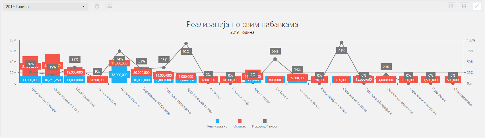
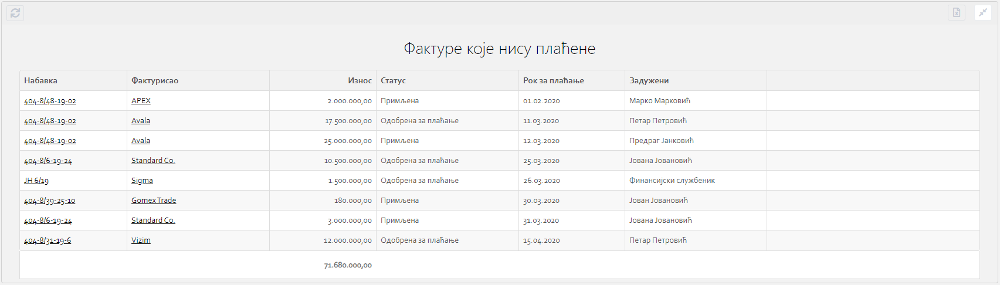
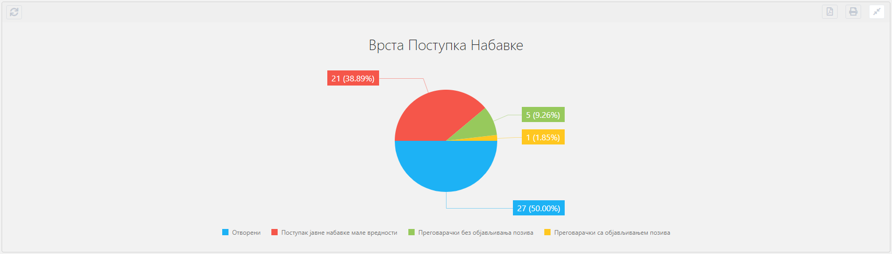
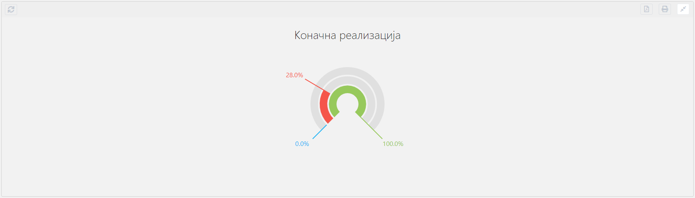

.. _izvestaji:

*********
Извештаји
*********

-Уводни текст, објаснити параметриѕацију, дати примере-

-УВОД

Параметри

Извештаји могу садржати параметре који дефинишу податке које можете видети на извештају.

Сваки корисник може да дода, промени или избрише параметар за одређени извештај.

Сваки извештај може бити другачији. Није нужно да сваки извештај садржи одређене параметре.

Код извештаја који садрже параметре, променом параметара добићете друге податке на самом извештају.

Сваки параметар дефинисан је именом и вредношћу параметра.

Једним именом можете дефинисати распон датума, одабир месеца или одабир године.

-слике са обележеним интеракцијама + описи интеракција (параметри еxпорт / сакриј/прикажи извештај)-

-СЛИКА

У горњем левом углу сваког извештаја налази се падајући мени са претходно изабраним називом извештаја.

Овај мени садржи све називе параметара који су у вези са одабраним извештајем. Одабиром другог параметра, кликом на назив тог параметра, добићете податке на извештају који су дефинисани изабраним параметром. 

Поред падајућег менија налази се дугме за освежавање извештаја и дугме за подешавање параметара.

Кликом на дугме за освежавање извештаја добићете последњу информацију која се налази на извештају.

Кликом на дугме за подешавање отвориће Вам се нови падајући мени у ком можете променити параметар Вашег извештаја односно његову вредност.

Врсте параметрара у зависности од извештаја, које можете променити могу бити  број године и одабир распона датума. Број године можете дефинисати уносом броја године (нпр. 2019).
Распон датума можете дефинисати уносом почетног и завршног датума параметра.

Уносом године или распона датума, кликом на Сачувај и примени отвара се прозор за унос назива параметра.

Испод поља за унос назива извештаја налази се “check in” опција чијом потврдом жељени извештај постављате као подразумевани извештај. 

Овом потврдом жељени параметар извештаја постаје увек одабран на том извештају док се одабир не промени.

У горњем десном углу сваког извештаја налази се: 

Дугме за штампу извештаја - Кликом на ово дугме можете одштампати жељени извештај. 

Дугме за извоз података - кликом на ово дугме можете генерисати жељени извештај као пдф документ и сачувати га на Вашем рачунару.

Дугме за смањивање извештаја - кликом на ово дугме умањујете одабрани извештај, како не би заузимао простор на прозору за извештаје, и добијате прегледнији приказ прозора са извештајима. Поновним кликом на исто дугме вратићете извештај на претходну величину.

Типови 
=========

Типови извештаја Ме Он апликације:
 * Ступчани графикон (bar chart)
 * Табела
 * Пита графикон (Pie chart)
 * Кључни показатељ (KPI)

Ступчани графикон (bar chart)
------------------------------

Ови типови извештаја погодни су када се користе на основу једне или више серија података. У сваком ступацу у извештају може бити приказано више вредности, односно више серија података. Уколико постоји више серија података, ступац ће бити подељен тако да приказује однос вредности добијених података. 

У примеру који следи можете видети ступчани извештај реализације свих набавки компаније за одређену годину. Свака набавка у овом извештају је представљена бојама које означавају следеће податке:

Плава боја представља реализовани износ. 
Црвена боја остатак износа који треба да се реализује. 
Сива вредност представља искоришћеност конкретне набавке у процентима.

Табела
-------------------

Табеларни извештаји представљају извештаје чији подаци су приказани у табели. Најчешћа примена оваквих извештаја може се видети на ентитету Фактуре. 

Пример: На оваквом извештају можете видети све Фактуре које нису плаћене. У самом извештају можете видети најбитније детаље Факутре - Статус, Износ, Рок за плаћање, Задужено лице, Број набавке и Назив уговорне стране.

.. note:: На оваквом типу извештаја кликом на Број набавке приказаће Вам се детаљи набавке, а кликом на Назив уговорне стране приказаће Вам се детаљи фактуре.

Пита графикон (Pie chart)
--------------------------

Пита графикон је тип извештаја који је најпогоднији за графички приказ једноставних извештаја на којима се приказује удео сваке од вредности.

У зависности од података самог извештаја вредности могу бити приказане бројчано и процентуално. 

Пример: На овом извештају можете видети врсте поступака набавки, број набавки одређене врсте и процентуални однос сваке врсте у односу на све набавке.  

Кључни показатељ (KPI)
-----------------------

Овај тип извештаја - КПИ (Key Performance Indicators) представља извештај у којем се ефикасно визуализују кључни показатељи перформанси. Компаније користе ове извештаје како би пратиле напредак пословања у односу на задате циљеве.

На оваквом типу извештаја можете видети успешност ваше компаније кроз коначну реализацију набавки.

