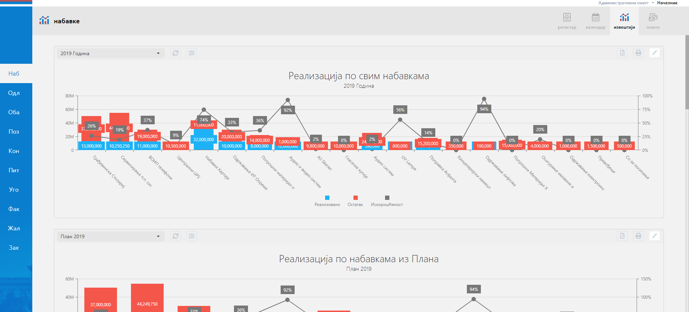

.. _izvestaji:

*********
Извештаји
*********
-Уводни текст, објаснити параметриѕацију, дати примере-

Параметри

Извештаји могу садржати параметре који дефинишу податке које ћете видети на извештају.

Сваки корисник може једноставно да дода, промени или избрише параметар за извештај.

Не морају сви извештаји имати параметре, али за извештаје који садрже параметере можете их на једноставан начин променити.

У горњем левом углу сваког извештаја можете видети падајући мени са већ одабраним називом извештаја.

У том менију видите све називе параметара који су генерисани за одабрани извештај.
Једноставним одабиром другог параметра тачније његовог назива добићете друге податке на извештају.

Поред падајућег менија налази се дугме са освежавање извештаја, као и дугме за подешавање.

Кликом на дугме за освежавање извештаја можете у сваком тренутку добити последњу информацију која се може налазити на извештају.

Дугме за подешавање отвара нови падајући мени у ком можете променити параметар вашег Вашег извештаја тачније његову вредност.
Врсте параметрара у зависности од извештаја, које можете променити могу бити број као број године и одабир распона датума. Распон датума се односи на почетни или датум од и завршни или датум до.
Уносом жељеног параметра броја године или распона датума, кликом на Сачувај и примени отвара се прозор за унос назива жељеног извештаја.
На овај начин можете једним именом дефнисати распон датума, одабир месеца или одабир године.

Испод поља за унос назива извештаја налази се одабир да ли да вам жељени извештај буде постављен као подразумевани извештај. Ова опција представља могућност да када додате жељени извештај, тај извештај ће увек бити одабран на том извештају.

Извоз

У горњем десном углу сваког извештаја налазе се три дугмета:

Штампa извештаја - Кликом на ово дугме можете одштампати жељени извештај. 

Еxcel извоз података - Кликом на ово дугме можете генерисати жељени извештај као пдф документ и скинути га на ваш рачунар.

Смањивање извештаја. Ради лакшег приказа прозора са извештајима, и уколико имате више извештаја, кликом на ово дугме смањујете одабрани извештај тако да не заузима простор на прозору за извештаје.*
Поновним кликом на исто дугме или кликом на назив извештаја

-слике са обележеним интеракцијама + описи интеракција (параметри еџпорт / сакриј/прикажи извештај)-

Уводни текст - опис из презентације

Овај део апликације садржи извештаје за одабрани ентитет. Ентитети 

screenshot sa obelezenim interakcijama + opisi interakcija

Типови 
=========

Испод можете видети типове извештаја које МеОн апликација: 

Ступчани графикон (bar chart)
------------------------------

-Опис слика, дати потанцијалан пример (за шта је користан)-

Ови типови извештаја су погодни када се користе на основу једне или више серија података. 

У конкретном примеру можемо видети реализацију набавки из плана, где плава боја представља реализовани износ. Црвена боја остатак износа који треба да се реализује. А сива вредност представља искоришћеност конкретне набавке. 

Табела
-------------------

-Опис слика, дати потанцијалан пример (за шта је користан)-

Табеларни извештаји представљају извештаје у којима се подаци приказују у табели. Најчешћа примена оваквих извештаја се може видети на ентитету Фактуре. На оваквом типу извештаја можете кликнути на број набавке као и на назив уговорне стране. Кликом на број набвке видећете детаље набавке. А кликом на назив уговорне стране детаље фактуре.

У конкретном примеру на оваквом извештају можете видети све фактуре које нису плаћене. У самом извештају можете видети најбитније детаље факутре поред број набавке као и назива уговорне стране, као што су статус, износ, рок за плаћање и задужено лице.

Пита графикон (Pie chart)
--------------------------

-Опис слика, дати потанцијалан пример (за шта је користан)-

Пита је тип извештаја који је најпогоднији за једноставне графиконе на којима приказујемо удео сваке од вредности. Вредност може бити приказана процентуално, као и бројчано. 

У конкретном примеру на оваквом извештају можемо приказати врсте поступака набавки.Б

Кључни показатељ (KPI)
-----------------------

-Опис слика, дати потанцијалан пример (за шта је користан)-

КПИ извештаји представљају тип извештаја који ефикасно визуализује кључне показатеље перформанси. 

У конкретном примеру на оваквом извештају можемо приказати успешност ваше компаније кроз на коначну реализацију набавки. 

