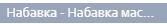
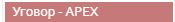

.. _kalendar:

********
Календар
********

Календар представља приказ свих датумских поља на одабраном ентитету из главног менија.

Кликом на било коју инстанцу, која се налази у датумском пољу календара, можете видети додатне детаље исте.

У зависности од пакета који користите можете видети разлчите информације у детаљима календара. Сваки корисник може доћи? до регистра изабраног ентитета кликом на назив ентитета и може послати поруку задуженом лицу кликом на његово име. 

:guilabel:`Атрибути`

:ref:`izvestaji <izvestaji>`

It refers to the section itself, see :ref:`moduli <moduli>`

Примери из праксе који могу илустровати једноставност оваког начина приказа информација:

Пример 1.

Начелник и ит службеник могу видети различите информације на истом ентитету. Начелник na entitetu конкурсна документација може видети статус набавке која је везана за изабрани ентитет: конкурсна документација, задужено лице, тип конкурсне документације, статус самог документа конкурсна документација... За исти одабрани енититет конкурсне документације Ит службеник може видети само: задужено лице, датум објаве документације као и број документације. На овај начин приказују се само одабране информације, у зависности од пакета који користите. Циљ оваквог приказа информација јесте да се на што лакши и бржи начин дође до информације која Вам је потребна. 

Пример 2.

Кликом на инстанцу? фактуре у одабраном датумском пољу календара и увидом у детаље корисник је уочио да, истиче рок за плаћање фактуре и да је статус фактуре "неплаћена".
Жели да провери зашто фактура није плаћена. Да би добио жељену информацију о плаћању потребно је да, контактира особу која је задужена за плаћање фактуре. То може урадити кликом на име задуженог лица у детаљима, након чега ће се отворити прозор за чет у којем ће корисник послати поруку одабраном лицу. Детаљније о чету и порукама у поглављу Пошта.

Постоји 5 различитих индикатора у бојама које можете видети на календару.

.. image:: ../_static/img/Kalendar/kalendar6.png
   :width: 200
   :height: 25
   :align: center

Светло сива боја - датум који је у прошлости за било који ентитет осим за онај који је одабран у главном менију.

Тамно сива боја - датум које је у прошлости за одабрани ентитет у главном менију.

.. image:: ../_static/img/Kalendar/kalendar8.png
   :width: 200
   :height: 25
   :align: center

Розе боја - данашњи датум за било који ентитет осим за онај који је одабран у главном менију.

.. image:: ../_static/img/Kalendar/kalendar9.png
   :width: 200
   :height: 25
   :align: center

Црвена боја - данашњи датум за одабрани ентитет у главном менију.

Светло бордо боја - датум који је у будућности за било који ентитет осим за онај који је одабран у главном менију.

.. image:: ../_static/img/Kalendar/kalendar11.png
   :width: 200
   :height: 25
   :align: center

Tамно бродо боја - датум који је будућности за одабрани ентитет у главном менију.

Да бисте видели датумска поља других ентитета, поред онога на коме се тренутно налазите, кликом на "прекидач" у горњем десном углу календара видећете информације свих осталих ентитета чија датумска поља видите на календару. На једноставан начин можете доћи до информације без потребе да мењате ентитет.

У горњем левом углу кликом на "бирач датума", можете променити месец и годину и тиме добити одабрани приказ ставки у календару. 

