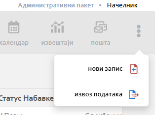

.. _navigacija:

**********
Навигација
**********

.. image:: ../_static/img/Navigacija/navigacija.png
   :width: 600
   :align: center

MeOn апликација је пројектована тако да кориснику пружи што већи комфор и једноставност приликом коришћења. Управо због тога постоји више начина навигације кроз апликацију.

Главни мени
===========

.. image:: ../_static/img/Navigacija/GavniMenu/GavniMenu.png
    :height: 300
    :align: center

Главни мени представља листа са леве стране екрана. Она садржи ентитете којима корисник може да приступи. Уз помоћ главног менија можемо се на једноставан начин кретати кроз ентитете и видети листе записа ентитета.

На сваком од ентитета главног мену-а корисник може добити нотификацију која ће бити приказана као беџ са бројем нотификација. Нотификације ће бити детаљније објашњене у поглављу Пошта.

Корисник може кликом на лого или назив компаније увек да се врати на почетну листу ентитета Набавке где год се у апликацији тренутно налази.

У самом дну Главног менија постоји икона за смањивање величине менија. Кликом на икону корисник може смањити величину главног мену-а и тиме добити већи преглед радне површине.

Breadcrumbs
===========

Breadcrumbs или мрвице од хлеба на српском, представља још један начин навигације којом корисник може да се креће кроз апликацију.

Breadcrumbs увек креће од селектованог ентитета ка смеру куда се корисник креће кроз ентитете.

Овде се можете видети исту набавку из угла два ентитета селектована у главном мени-у.

.. image:: ../_static/img/Navigacija/Bradcrumbs/Breadcrumbs3.png
   :width: 700
   :height: 50
   :align: center

Кликом на било који елемент у breadcrumbs-у, корисник ће видети податке селектованог елемента на радној површини.

Елементи који се приказују у breadcrumbs-у, могу бити листе или детаљи селектованог ентитета.

Тако на пример корисник кликом на фактуре може видети листу свих фактура одређене набавке, или кликом на број уговора може видети детаље самог уговора.  

.. image:: ../_static/img/Navigacija/Bradcrumbs/Breadcrumbs.png
   :width: 700
   :height: 50
   :align: center

На приказаној слици корисник гледа детаље фактуре 404-8/31-18-12 и жели да провери други уговор који постоји на истој набавци.

Корисиник може једноставним кликом на "Уговори" у breadcrumbs-у добиће све уговоре исте набавке.

Мени са опцијама
================

.. image:: ../_static/img/Navigacija/MenuSaOpcijama/menuopcije2.png
   :width: 400 
   :height: 300
   :align: center

У горњој десној страни екрана налази се икона са три тачкице које представљају мени са опцијама. Опције менија зависе од позиције корисника у апликацији.

 Неки од могућих опција које ће касније бити објашњене су :

 *   Додавање новог записа
 *  Извоз података из грида
 *  Брисање записа
 *  Нова порука