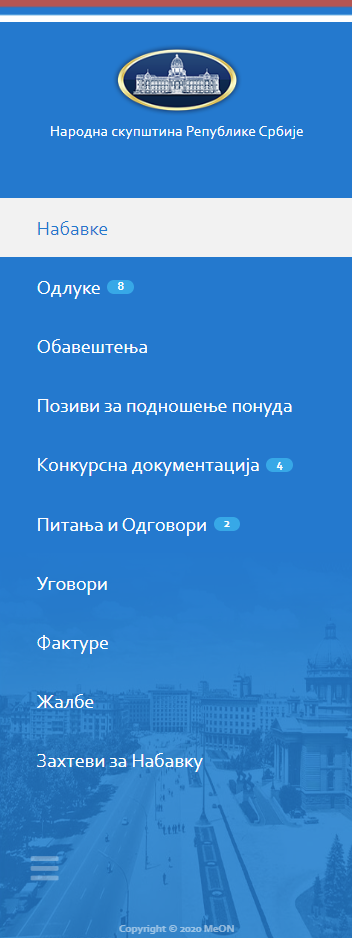

.. _navigacija:

**********
Навигација
**********

.. image:: ../_static/img/Navigacija/navigacija.png
   :width: 600

MeOn апликација је пројектована тако да кориснику пружи што већи комфор и једноставност приликом коришћења. Управо због тога постоји више начина навигације кроз апликацију.

Главни мени
===========

Главни мени представља листа са леве стране екрана. Она садржи ентитете којима корисник може да приступи. Уз помоћ главног менија можемо се на једноставан начин кретати кроз ентитете и видети листе записа ентитета.

.. note::  У самом дну Главног менија имамо икону за смањивање величине менија.

Breadcrumbs
===========

.. image:: ../_static/img/Navigacija/Bradcrumbs/Breadcrumbs.png
   :width: 600

Breadcrumbs или мрвице од хлеба на српском, представља још један начин навигације којом корисник може да се креће кроз апликацију.

Мени са опцијама
================

.. image:: ../_static/img/Navigacija/MenuSaOpcijama/menuopcije1.png
   :width: 300 
   :height: 300

.. image:: ../_static/img/Navigacija/MenuSaOpcijama/menuopcije2.png
   :width: 300 
   :height: 300

У горњој десној страни екрана налази се икона са три тачкице које представљају мени са опцијама. Опције менија зависе од позиције корисника у апликацији.

 Неки од могућих опција које ће касније бити објашњене су :

 *   Додавање новог записа
 *  Извоз података из грида
 *  Брисање записа
 *  Нова порука