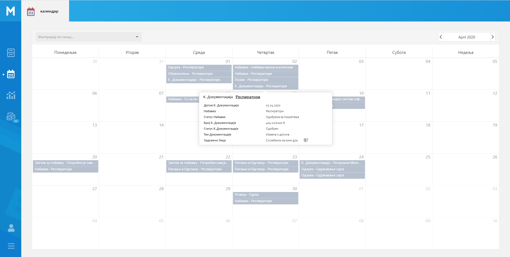
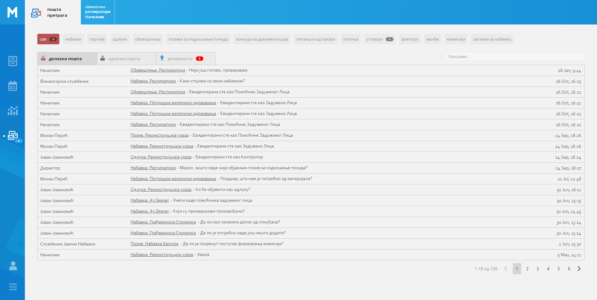

.. _navigacija:

Навигација
===========

MeON апликација је пројектована тако да кориснику пружи што већи комфор и једноставност коришћења приликом обраде великог броја докумената и података уопште. 

- слика са секцијама

На сваком од екрана апликације постоји секција са леве стране која представља предефинисани списак ентитета са којима корисник може 'радити'. Под овим подразумевамо, претрагу, унос, измену, анализу и колаборацију на нивоу било које инстанце коју корисник има право да види. Раније смо поменули пакете и објаснили њихову улогу у апликацији. Овде ћемо поновити да они (између осталог) омогућавају да се тачно одреде ентитети које корисник може видети у апликацији.

.. list-table:: :align: center

    * - .. figure:: ../_static/img/Navigacija/GlavniMenu/GlavniMenu6.png
           :height: 700px
           :align: center

           Пример менија за начелника

      - .. figure:: ../_static/img/Navigacija/GlavniMenu/GlavniMenu7.png
           :height: 700px
           :align: center

           Пример менија за ИТ службеника

На сваком од ентитета главног менија можемо добити нотификацију која ће бити приказана као "беџ" са бројем нотификација. Нотификације ће бити детаљније објашњене у поглављу :ref:`Пошта<posta>`.

Кликом на лого или назив компаније можемо увек да се вратимо на почетну листу ентитета Набавке, без обзира на то у ком делу апликације смо тренутно позиционирани.

.. Tip:: Главном менију можемо променити величину, кликом на икону која се налази у доњем левом углу главног менија. Тиме можемо добити већи преглед радне површине.

.. _moduli:

Модули
------------

У MeON апликацији тренутно постоје четири модула која ће посебно бити објашњена:

* :ref:`Регистар<registar>`
* :ref:`Календар<kalendar>`
* :ref:`Извештаји<izvestaji>`
* :ref:`Пошта<posta>`

Битно је напоменути да је сваки модул контексно повезан са селектованим ентитетом из главног менија. Ако је у главном менију селектован ентитет Набавке а у менију модула селектован Регистар, ово значи да корисник гледа Регистар Набавки. Аналогијом са овим примером долазимо до закључка да корисник врло лако може доћи до жељеног контекста: Регистар Уговора, Календар Набавки, Пошта на нивоу Конкурсне Документрације, Извештаји у оквиру Фактура итд.

.. figure:: ../_static/img/Evidencija/registar.png
   :width: 700
   :align: center

   Регистар

   Календар

.. figure:: ../_static/img/Evidencija/izvestaji.png
   :width: 700
   :align: center

   Извештаји

   Пошта

.. _breadcrumbs:

Интерактивни наслов
-------------------

Интерактивни наслов представља секцију MeON апликације која омогућава кориснику кретање кроз хијерархију докумената. Како је то замишљено?

Упознавајући се са :ref:`ентитетима<entiteti>` научили смо да су они међусобно везани хијерархијским односом. Ентитет Набавка је у нашем случају главни (врховни) ентитет. Конкретна набавка (инстанца) може имати једну верзију конкурсне документације а може је имати и више (измена и допуна). Ова законитост нам помаже да схватимо да је ентитет Конкурсна Документација уствари подентитет Набавке. Даље, инстанца набавке може имати један или више уговора (поруджбеница, оквирних споразума). Ово такође сврстава Уговор као подентитет Набавке. По одређеном уговору можемо имати више фактура. Ово значи да је Фактура подентитет Уговора итд.

Интерактивни наслов је пројектован да кориснику омогући лаку навигацију кроз хијерархију докумената. Ова функционалност је имплементирана преко Breadcrumbs-а или "мрвица од хлеба"

**набавке** > 

**набавке** > **набавка штампача** > 

**набавке** > **набавка штампача** > **уговори** > 

**набавке** > **набавка штампача** > **уговори** > **50602/20** > 

**набавке** > **набавка штампача** > **уговори** > **50602/20** > **фактуре** > 

**набавке** > **набавка штампача** > **уговори** > **50602/20** > **фактуре** > **фактура 5938/20**

Ово су примери различитих наслова у хијерархијској структури набавке. Први наслов означава да се налазимо на регистру набавки. Други наслов означава да смо на детаљу набавке која се зове **набавка штампача**. Трећи наслов значи да гледамо листу уговора за набавку штампача. Четврти наслов означава да смо изабрали конкретан уговор у набавци. Пети наслов значи да гледамо листу фактура за изабрани уговор. И на крају, последњи наслов значи да гледамо детаље конкретне фактуре.

Кликом на било који елемент у breadcrumbs-у, можемо се кретати кроз хијерархију и видети податке селектованог елемента на радној површини.

Breadcrumbs увек полази од селектованог ентитета (из главног менија) ка смеру куда се корисник креће кроз ентитете. Ово значи да уколико је селектовани ентитет **Уговори**, могуће вредности интерактивног наслова могу бити:

**уговори** > 

**уговори** > **50602/20** > 

**уговори** > **50602/20** > **фактуре** > 

**уговори** > **50602/20** > **фактуре** > **фактура 5938/20**

Информације које се приказују када кликнемо на неки елемент у breadcrumbs-у, могу бити листе или детаљи селектоване инстанце ентитета.

.. Tip:: Интерактивни наслов има своју функцију у модулу Регистар и Пошта. У осталим модулима наслов није интерактиван.