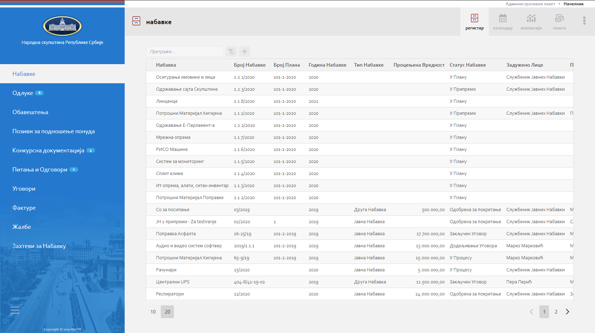

.. _navigacija:

Навигација
===========

MeOn апликација је пројектована тако да кориснику пружи што већи комфор и једноставност приликом коришћења. Управо због тога постоји више начина навигације кроз апликацију.

Регистар
---------

Календар
---------

Извештаји
----------

Пошта
----------

Главни мени
===========

.. image:: ../_static/img/Navigacija/GlavniMenu/GlavniMenu4.png
    :height: 300
    :align: center

Главни мени представља листа са леве стране екрана. Листа садржи ентитете којe можете да видите и којима можете да приступите, у зависности од пакета који имате. Уз помоћ главног менија можете се, на једноставан начин, кретати кроз ентитете и видети листе записа ентитета.

.. image:: ../_static/img/Navigacija/GlavniMenu/GlavniMenu5.png
    :height: 300
    :align: center

На сваком од ентитета главног менија можете добити нотификацију која ће бити приказана као "беџ" са бројем нотификација. Нотификације ће бити детаљније објашњене у поглављу Пошта.

Кликом на лого или назив компаније можете увек да се вратите на почетну листу ентитета Набавке, без обзира на то у ком делу апликације сте тренутно позиционирани.

Главном менију можете променити величину, кликом на икону која се налази у доњем левом углу главног менија. Тиме можете добити већи преглед радне површине.
