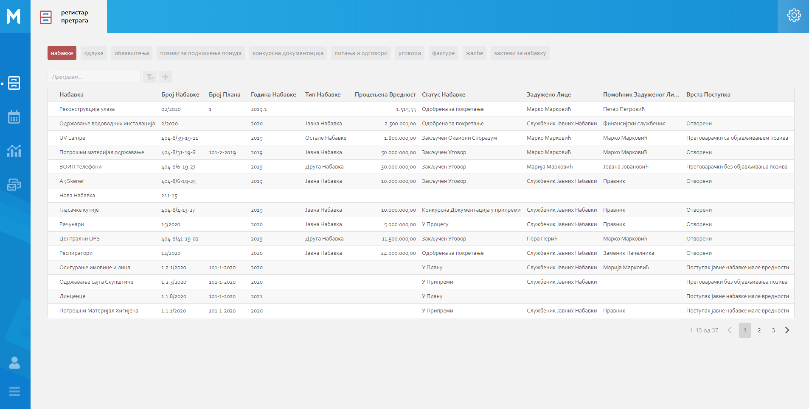
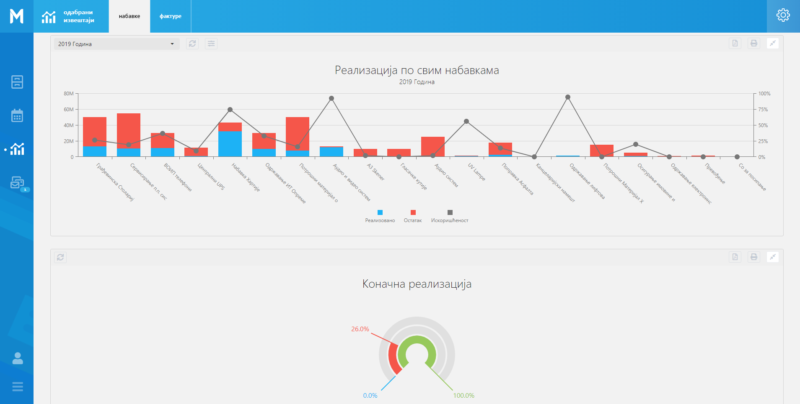

.. _navigacija:

Навигација
===========

MeON апликација је пројектована тако да кориснику пружи што већи комфор и једноставност коришћења приликом обраде великог броја докумената и података уопште. 

- слика са секцијама

На сваком од екрана апликације постоји секција са леве стране која представља предефинисани списак ентитета са којима корисник може 'радити'. Под овим подразумевамо, претрагу, унос, измену, анализу и колаборацију на нивоу било које инстанце коју корисник има право да види. Раније смо поменули пакете и објаснили њихову улогу у апликацији. Овде ћемо поновити да они (између осталог) омогућавају да се тачно одреде ентитети које корисник може видети у апликацији.

   .. figure:: ../_static/img/Navigacija/GlavniMenu/GlavniMenu6.png
           :height: 400px
           :width: 700px
           :align: center

           Пример менија за начелника

   .. figure:: ../_static/img/Navigacija/GlavniMenu/GlavniMenu7.png
           :height: 400px
           :width: 700px
           :align: center

           Пример менија за ИТ службеника

:ref:`Пошта<posta>`.

Кликом на лого или назив компаније можемо увек да се вратимо на почетну листу ентитета Набавке, без обзира на то у ком делу апликације смо тренутно позиционирани.

.. Tip:: Главном менију можемо променити величину, кликом на икону која се налази у доњем левом углу главног менија. Тиме можемо добити већи преглед радне површине.

.. _moduli:

Модули
------------

У MeON апликацији тренутно постоје четири модула која ће посебно бити објашњена:

* :ref:`Регистар<registar>`
* :ref:`Календар<kalendar>`
* :ref:`Извештаји<izvestaji>`
* :ref:`Пошта<posta>`

Сваки од модула je контексно повезан са сваким од ентитета на свој начин, објаснићемо укратко везу ентитета са сваким од њих а биће још детаљније објашњени у сваком модулу посебно.

**Регистар** има могућност селектовања ентитета посебно. У горњем делу екрана се налазе сви ентитети којима имамо приступ. Приликом отварања модула Регистар, увек нам је селектован ентитет Набавка као главни ентиет. MeON апликација памти наш последње одабрани ентитет који смо претраживали и приликом промене 

**Календар** садржи филтер по пољима ентитета, односно садржи све ентитете и њихова поља по којима можемо филтрирати односно приказати податке на календару. 

**Извештаји** имају могућност селектовања ентитета посебно, у горњем делу екрана при одабиру модула Извештаји. Поред одабира ентитета, Извештаји садрже и Одабране Извештаје који су скуп извештаја који смо ми одабрали. Одабрани извештаји могу садржати извештаје од више различитих ентитета.

**Пошта** слично као и Регистар, пошта садржи могућност селектовања ентитета у горњем делу екрана. Са малом разликом у односу на Регистар, Пошта садржи опцију "Све" која је уједно и преселектована приликом отварања модула Пошта.

Битно је напоменути да је сваки модул контексно повезан са селектованим ентитетом из главног менија. Ако је у главном менију селектован ентитет Набавке а у менију модула селектован Регистар, ово значи да корисник гледа Регистар Набавки. Аналогијом са овим примером долазимо до закључка да корисник врло лако може доћи до жељеног контекста: Регистар Уговора, Календар Набавки, Пошта на нивоу Конкурсне Документрације, Извештаји у оквиру Фактура итд.

   Регистар

.. figure:: ../_static/img/Evidencija/kalendar.png
   :width: 700
   :align: center

   Календар

   Извештаји

.. figure:: ../_static/img/Evidencija/posta.png
   :width: 700
   :align: center

   Пошта

Навигациони табови
--------------------

Табови или навигациони табови су саставни део MeON апликације, представљају приказ 

   Навигациони таб