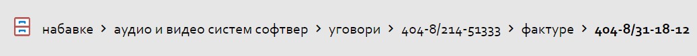

.. _navigacija:

**********
Навигација
**********

.. image:: ../_static/img/Navigacija/navigacija.png
   :width: 600
   :align: center

MeOn апликација је пројектована тако да кориснику пружи што већи комфор и једноставност приликом коришћења. Управо због тога постоји више начина навигације кроз апликацију.

Главни мени
===========

.. image:: ../_static/img/Navigacija/GlavniMenu/GlavniMenu4.png
    :height: 300
    :align: center

Главни мени представља листа са леве стране екрана. Листа садржи ентитете којe можете да видите и којима можете да приступите, у зависности од пакета који имате. Уз помоћ главног менија можете се, на једноставан начин, кретати кроз ентитете и видети листе записа ентитета.

.. image:: ../_static/img/Navigacija/GlavniMenu/GlavniMenu5.png
    :height: 300
    :align: center

На сваком од ентитета главног менија можете добити нотификацију која ће бити приказана као "беџ" са бројем нотификација. Нотификације ће бити детаљније објашњене у поглављу Пошта.

Кликом на лого или назив компаније можете увек да се вратите на почетну листу ентитета Набавке, без обзира на то у ком делу апликације сте тренутно позиционирани.

Главном менију можете променити величину, кликом на икону која се налази у доњем левом углу главног менија. Тиме можете добити већи преглед радне површине.

Breadcrumbs
===========

Breadcrumbs или "мрвице од хлеба", представља још један начин навигације којом можете да се креће кроз апликацију.

Breadcrumbs увек полази од селектованог ентитета ка смеру куда се крећете кроз ентитете.

Овде можете видети исту набавку из угла два ентитета која су селектована у главном менију.

.. image:: ../_static/img/Navigacija/Bradcrumbs/Breadcrumbs2.png
   :width: 400
   :height: 50
   :align: center

Кликом на било који елемент у breadcrumbs-у, можете видети податке селектованог елемента на  радној површини.

Елементи који се приказују у breadcrumbs-у, могу бити листе или детаљи селектованог ентитета.

Кликом на фактуре у breadcrumbs-у можете видети листу свих фактура одређене набавке, или кликом на број уговора можете видети детаље самог уговора.  

На приказаној слици корисник претражује/гледа детаље фактуре 404-8/31-18-12 и жели да провери други уговор који постоји на истој набавци.

.. image:: ../_static/img/Navigacija/Bradcrumbs/Breadcrumbs1.png
   :width: 400
   :height: 50
   :align: center

Корисиник може једноставним кликом на "Уговори" у breadcrumbs-у да види све уговоре исте набавке.

Мени са опцијама
================

.. image:: ../_static/img/Navigacija/MenuSaOpcijama/menuopcije1.png
   :width: 400 
   :height: 300
   :align: center

.. image:: ../_static/img/Navigacija/MenuSaOpcijama/menuopcije2.png
   :width: 400 
   :height: 300
   :align: center

У горњем десном углу екрана, налази се икона са три тачкице које представљаја мени са опцијама. Опције менија зависе од позиције корисника у апликацији.

Уколико се налазите на ентитету Набавке или Захтеви за Набавку, мени са опцијама садржи: Нови Запис и Извоз Података.

Нови Запис 

Нови запис 

 Неки од могућих опција које ће касније бити објашњене су :

 *   Додавање новог записа
 *  Извоз података из грида
 *  Брисање записа
 *  Нова порука