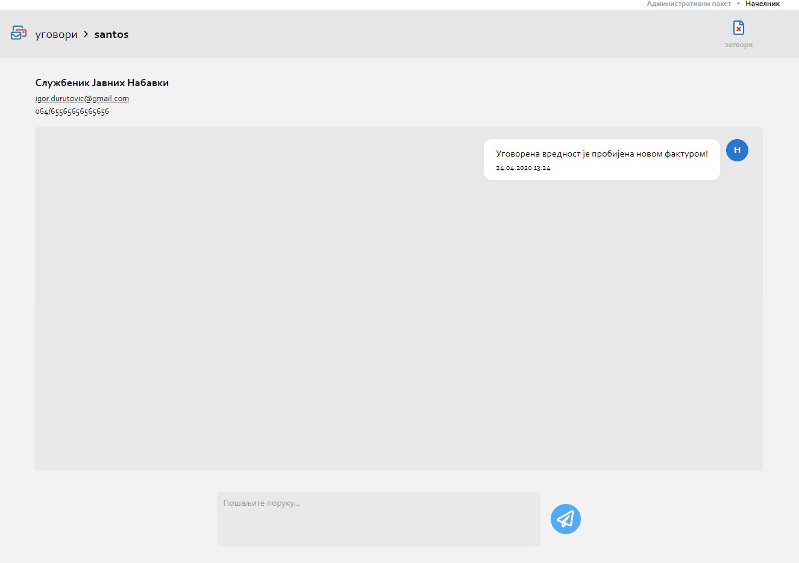

.. _posta:

********
Пошта
********
.. image:: ../_static/img/Posta/posta.png
   :width: 600
   :align: center

Опис из презентације

Пошта представља део апликације који садржи информације у виду порукa i нотификацијa.

screenshot sa obelezenim interakcijama + opisi interakcija

Пошта представља део апликације који садржи информације у виду порукa i нотификацијa.
У пошти можете видети Ваше примљене и послате поруке.

Можда слика овде послате и примљене поруке?

У овом делу апликације можете видети нотификације везане за додавање нових докумената и нотификације везане за додавање или измену поља у документу.
Нотификације које ће Вам бити приказане разликују се у зависности од Вашег пакета као и ентитета на коме се налазите.

Кликом на примљене и послате поруке у пошти отварате прозор за Чет у којем можете остварити комуникацију везану за конкретан ентитет.

Кликом на назив документа у примљеним, послатим порукама и нотификацијама доћи ћете до  
новог прозора поште у којем је приказна сва пошта везана за одабрани документ (примљене, послате поруке и нотификације).

Да бисте видели пошту других ентитета, поред оне на којој се тренутно налазите, кликом на "прекидач" у горњем десном углу видећете пошту свих осталих ентитета, у зависности од пакета који имате. На једноставан начин можете доћи до информације без потребе да мењате ентитет.

Чет
---

Чет је још један начин комуникације у оквиру ове апликације.
Коришћењем Чет-а на најлакши начин можете остварити комуникацију везану за конкретан ентитет.
Кликом на Мени са опцијама док смо у детаљу неког ентитета и одабиром Нова Порука можемо започети чет са неком особом.
Такође кликом на корисника из детаља календара можемо иницирати чет.

