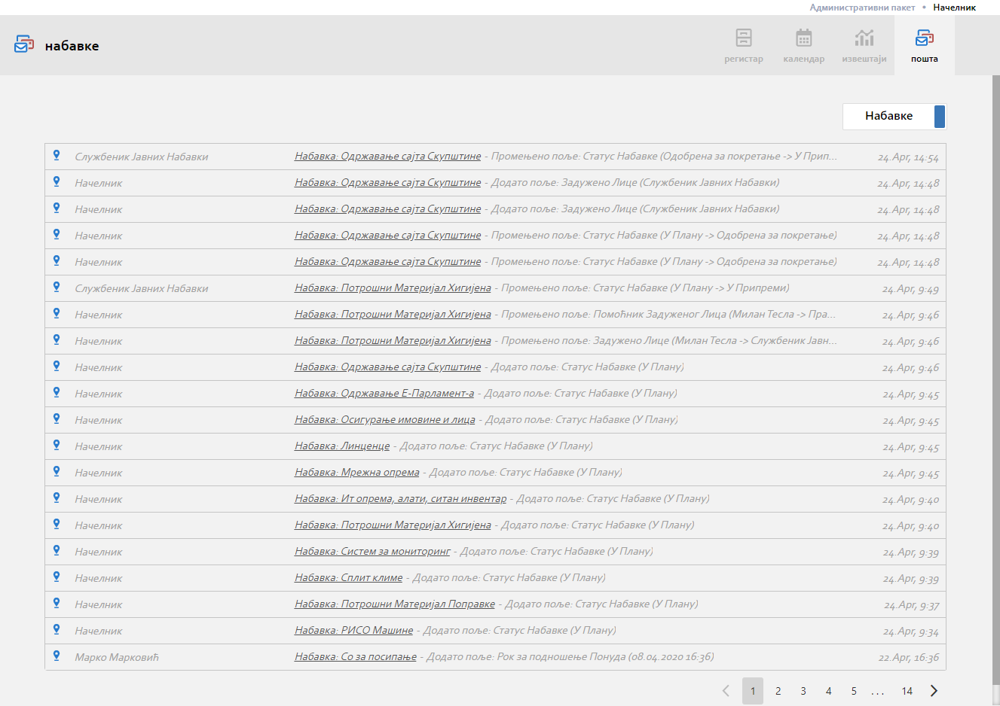

.. _posta:

********
Пошта
********

Пошта представља део апликације који садржи све информације у виду поруке, нотификације

Врсте информација
-----------------

Врсте информација које пошта садржи можемо поделити на нофикације

Инбокс
------

Чет
---

.. image:: ../_static/img/Posta/posta1.png
   :width: 600
   :align: center

Чет је још један начин комуникације у оквиру ове апликације.
Коришћењем Чет-а на најлакши начин можете остварити комуникацију везану за конкретан ентитет.
Кликом на Мени са опцијама док смо у детаљу неког ентитета и одабиром Нова Порука можемо започети чет са неком особом.
Такође кликом на корисника из детаља календара можемо иницирати чет.

