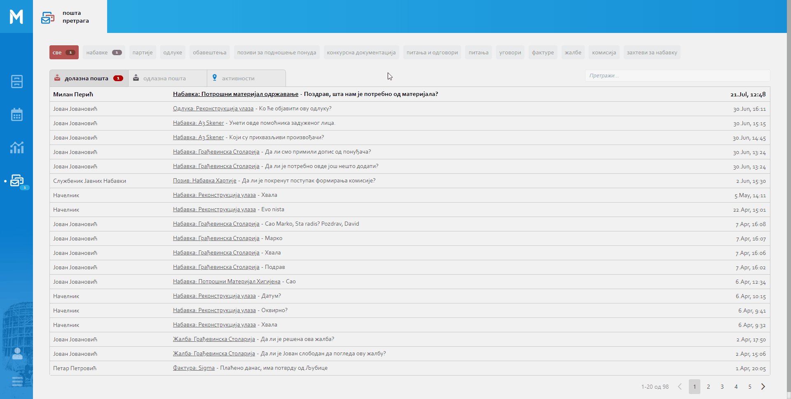
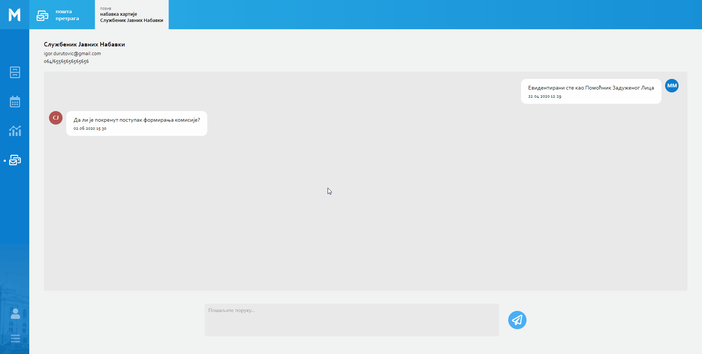

.. _posta:

********
Пошта
********

Пошта представља део MeOn апликације који садржи информације у виду порукa и нотификацијa за одабрани ентитет. Све информације у овом модулу приказане су у листи, по хронолошком реду. 

Информације које се налазе у овој листи приказане су као:

Поруке 
  Примљене поруке, послате поруке. Осим порука које можемо послати или примити, можемо добити и поруку која нас обавештава да смо евидентирани на типу поља Корисник неке инстанце ентитета. Ако је неко задужио нас као задужено лице, добићемо поруку "Евидентирани сте као Задужено Лицe". Исто важи и за остала поља типа Корисник ( Помоћник Задуженог Лица, Контролор, Потписник...).

Нотификације 
 Нотификације које се односе на документ, могу приказати иформације о самом документу. Када је неки документ додат или обрисан.
 Нотификације које се односе на поље документа, могу приказати информације о самом пољу документа. Када је неко поље документа додато, промењено или обрисано.

Све нове поруке и нотификације налазе се на врху ове листе. Остале прочитане поруке, послате поруке и прегледане нотификације налазе се у наставку листе. У листи свака примљена порука, послата порука и нотификација садржи конкретну инстанцу ентитета и садржину истих. 

Нотификације које ће нам бити приказане разликују се у зависности од нашег пакета као и ентитета на коме се тренутно налазимо.

Индикатор нових порука и нотификација приказан је беџом, у горњем десном углу, на икони поште. Кликом на икону поште са беџом добићемо увид у листу свих нотификација и порука. Отварањем ове листе нове нотификације биће означене као "прегледане", и тиме ће се индикатор умањити за број прегледаних нотификација. Поруке остају "непрегледане" и индикатор непромењен, све док не отворимо нове примљене поруке.  

Кликом на примљене и послате поруке у пошти отварамо прозор за Чет у којем можемо остварити, односно наставити комуникацију везану за одабрану инстанцу ентитета.

Кликом на назив документа у примљеним, послатим порукама и нотификацијама доћи ћемо до новог прозора поште у којем је приказна сва пошта везана за одабрану инстанцу ентитета (примљене, послате поруке и нотификације).

Да бисмо видели пошту других ентитета, поред оног на ком се тренутно налазимо, кликом на "прекидач" у горњем десном углу, видећемо пошту свих осталих ентитета, у зависности од пакета који имамо. На једноставан начин можемо доћи до поште свих ентитета, без потребе да мењамо ентитет.

Чет
---

Чет је још један начин комуникације у оквиру МеОн апликације.
У чет-у се може остварити комуникација између два корисника.

Постоји више начина начина за започињање комуникације преко чет-а:

1. Кликом на Мени са опцијама, у горњем десном углу детаља инстанце ентитета, и одабиром Нова Порука отвара нам се прозор за Одабир кореспондента. Кликом на име кореспондента, отварамо нови прозор за чет и тиме започињемо комуникацију са одабраном особом. 

2. Кликом на име особе у детаљима инстанце ентитета отварамо нови прозор за чет и можемо започети комуникацију са одабраном особом.

3. Из календара у детаљима инстанце одабраног ентитета и кликом на име корисника отварамо нови прозор за чет и можемо започети комуникацију са одабраном особом.

4. Кликом на примљену или послату поруку у пошти, отвара нам се прозор за чет.

О истој инстанци ентитета могу комуницирати различити корисници.
Коришћењем чет-а на најлакши начин можемо остварити комуникацију везану за инстанцу одабраног ентитета. Свака послата порука у чет-у односи се на конкретану инстанцу ентитета. Конкретна инстанца ентитета увек се види и приказана је у горњем левом углу прозора за чет. 

Пример:

Службеник за јавне набавке уочио је да у набавци "Осигурање имовине и лица" недостаје Рок за подношење понуда и податак о Општем Речнику Набавке (ОРН). Увидом у детаље инстанце овог ентитета, кликом на име задуженог лица, службеник отвара прозор за чет и поставља питање задуженом лицу о року за подношење понуда. Кликом на име помоћника задуженог лица, у детаљима инстанце истог ентитета, отвара нови прозор за чет и поставља питање о податку ОРН-а.

Овакав пример представља једноставан начин комуникације, који се односи на конкретну инстанцу ентитета. Кроз два независна чета корисник је остварио комуникацију са две различите особе о истој инстанци ентитета. Корисник је директно задуженом лицу и његовом помоћнику поставио питање, без потребе да конкретизује инстанцу ентитета. На основу инстанце ентитета приказане у примљеној поруци поште и у прозору за чет, лице којем је порука упућена зна о којој инстанци ентитета се ради.

Чет запосленима олакшава комуникацију без додатног коришћења осталих средстава комуникације.

У прозору за чет, у горњем левом углу, налази се име и презиме кореспондента, број телефона и мail адреса. Кликом на мail адресу кореспондента, можемо послати мail путем екстерне мail апликације коју тренутно користимо на нашем рачунару.

На среднини прозора за чет, налази се поље за преглед примљених и послатих порука.

Поруке у чету приказане су хијерархијски од најновије до најстарије, у смеру навише.

Свака порука садржи датум и време када је порука примљена односно послата.

.. Tip:: Кроз поље за преглед порука можете се кретати коришћењем scroll-a

Поље за слање поруке и дугме Пошаљи налази се на дну екрана.

.. Tip:: Поруку можете послати и комбинацијом тастера Shift + Enter

Кликом на дугме затвори, у горњем десном углу, затвара се прозор за чет и вратићемо се на екран на којем смо предходно били.
