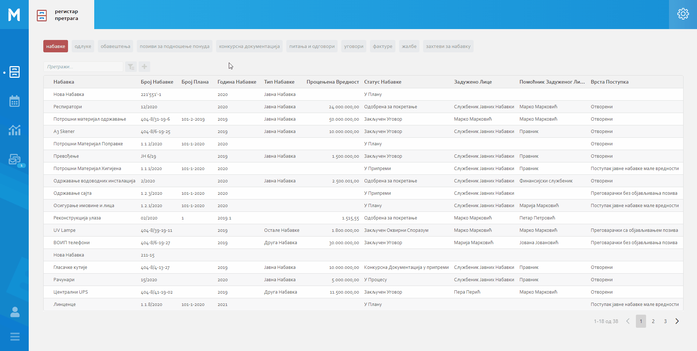
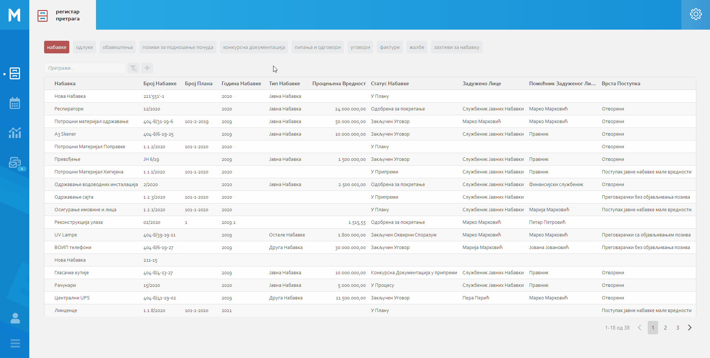
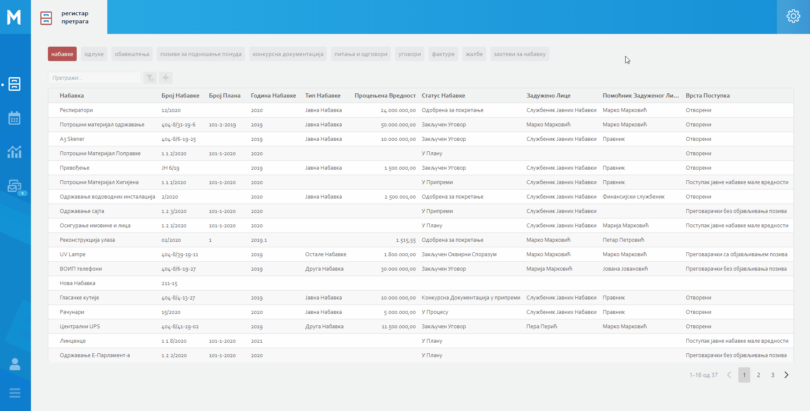
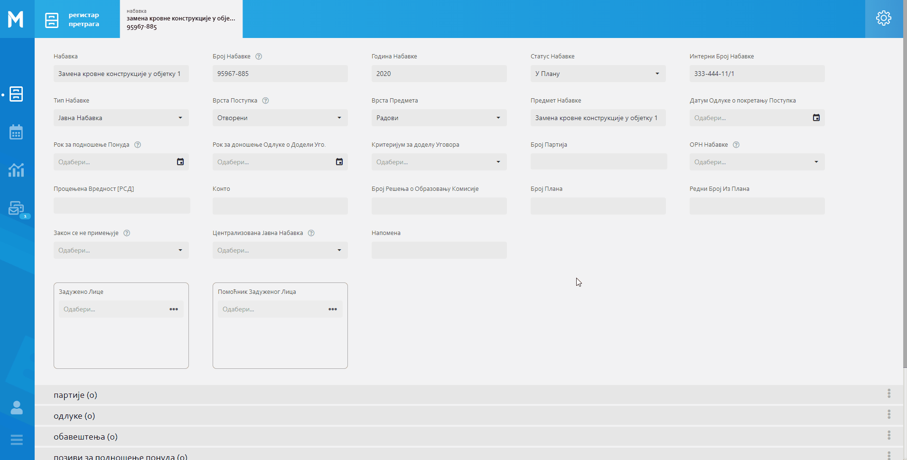
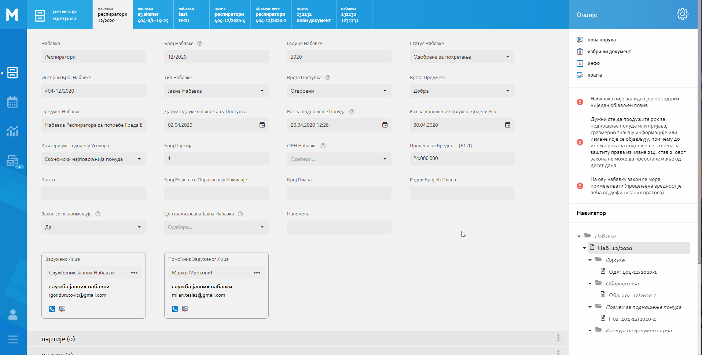

.. _registar:

**********
Регистар
**********

-УВОДНИ ТЕКСТ СА Сликама Листе и детаља  са објашњењем боотом менија

.. image:: ../_static/img/Evidencija/evidencija.png
   :width: 600
   :align: center

Мени са опцијама

.. image:: ../_static/img/Navigacija/MenuSaOpcijama/menuopcije1.png
   :width: 400 
   :height: 300
   :align: center

.. image:: ../_static/img/Navigacija/MenuSaOpcijama/menuopcije2.png
   :width: 400 
   :height: 300
   :align: center

У горњем десном углу екрана, налази се икона са три тачкице које представљаја мени са опцијама. Опције менија зависе од позиције корисника у апликацији.

Уколико се налазите на ентитету Набавке или Захтеви за Набавку, мени са опцијама садржи: Нови Запис и Извоз Података.

Нови Запис 

Нови запис 

 Неки од могућих опција које ће касније бити објашњене су :

 *  Додавање новог записа
 *  Извоз података из листе
 *  Брисање записа
 *  Нова порука

Типови поља
------------

Подаци који се уносе у базу категоризују се на основу текста, бројева, датума…

Свака инстанца ентитета састоји се од поља и њихових вредности. Свако поље ентитета је дефинисано одређеним типом поља.

Типова поља описују карактеристике и понашање података додатих у конкретно поље.

Тип податка поља је најважније својство због тога што одређује који тип податка може да се сачува у бази.

На овај начин кориснику је ограничен и поједностављен унос података. У пољу за нумеричку вредност можете сачувати само нумеричке податке. Ако је тип податка алфанумерички, можете сачувати податке који се састоје од текста,нумеричких вредности или њихове комбинације. Текстуалну вредност не можете унети у поље које је предвиђено за нумеричку вредност.

Алфанумерички тип
===================

Алфанумерички тип поља представља комбинацију текста, бројева и знакова који не учествују у рачунским операцијама (Нпр Број Набавке).

Пример: 

У поље за Назив Набавке, корисник уноси текстуалну вредност у поље Назив, комбинацијом слова, односно речи и бројева - "РИК ЈН 2/19 - Набавка А3 скенера".

Нумерички тип
==============

Тип поља Број представља поље за унос нумеричке вредности. Овај тип поља ограничен је само за унос нумеричке вредности.

Представља генерални тип поља за све нумеричке вредности - година набавке, број набавке, процењена вредност…

Нумерички тип поља се може користити у рачунарским операцијама које су приказане у Извештајима.

Пример:  

Година Набавке : “2020”

Износ
======

Тип поља Износ представља, као и тип поља Број, поље за унос нумеричке вредности. Разлика између ова два поља јесте у приказу податка које је корисник унео. Број ће бити приказан онако како је корисник и унео, без икаквог форматирања, а Износ ће бити форматиран.

Форматирање броја значи да се унети податак форматира и приказује као износ. Ако је износ у овом пољу “100000”, податак ће Вам бити приказан као “100.000”. 

Можете унети и податак који садржи децимални запис, уносом тачке у поље након целих бројева и уписивањем децимала. Можете унети највише три децимале иза зареза.  

Пример: 

Када у овај тип поља унесете износ “1515.55”, податак ће Вам бити приказан као “1.515,55”

Датум, Датум и време
=====================

Тип поља Датум, представља поље у које корисник може да унесе датум и рок у МеОн апликацији.

Кликом на поље за унос датума приказаће Вам се “мини” календар. Одабиром датума у календару, кликом на жељени датум, уносите вредност у датумско поље.

У календару датумског поља увек је означен датум текућег дана. 

По “мини” календару можете се кретати кликом на знак > који помера приказ на календару за један месец/годину унапред или на кликом на знак < који помера приказ за један месец/годину уназад.

Жељени месец, односно годину можете да изаберете тако што ћете кликом на име тренутно одабраног месеца отворити изборну табелу, где можете одабрати жељени месец. Уместо назива месеца приказаће Вам се година и поновним кликом на годину отворићете изборну табелу за годину.

Тип поља Датум и време, као и тип поља Датум, представља поље које означава датум, односно рок. Ова два типа разликују се у томе што у пољу за Датум и време корисник поред датума може унети и жељено време одабиром у “мини” календару. Поред календара налази се сат на којем корисник може да упише време или кликом на стрелице одабере жељено време.

У "мини" календару који садржи могућност одабира времена, налазе се три дугмета за интеракцију:

- Дугме “Данас” - Кликом на дугме Данас, где год се налазили на календару, увек ће Вам бити одабран тренутни датум.

- Дугме “Сачувај” - Кликом на дугме Сачувај сачуваћете жељени одабир датума и времена.  

- Дугме “Одустани” - Кликом на дугме Одустану поништићете одабрани унос и затворити календар.

Логичка вредност
=================

Логичка вредност представља тип поља који садржи логичке вредности "да" и "не". Овим типом поља представљена су поља која садрже једноставну информацију о конкретом пољу. Вредност уносите кликом на поље и из падајућег менија бирате жељену вредност.

Пример:

Кликом на поље "Закон се примењује", на ентитету Набавка, и одабиром логичких вредности "да" или "не" корисник, приликом прегледа детаља Набавке, може добити информацију да ли се на инстанци ентитета Набавка закон примењује или не.

Корисник
=========

Тип поља Корисник представља поље у које корисник уноси особу као жељену вредност. Кликом на ово поље отвара се прозор за одабир корисника. Одабиром корисника унета је вредност поља типа корисник. 

Код поља која су типа Корисник, одабиром жељене особе МеОн апликација шаље нотификацију и маил одабраној особи и на тај начин, у зависности од самог поља, је обавештава да одабрана на том пољу односно инстанци ентитета.

Пример који илуструје овај тип поља може бити одабир задуженог лица на ентитету. Одабрана особа обавештава се путем нотификације у виду поруке и маил-а да је одабрана као задужено лице на инстанци ентитета.

Предефинисана вредност
=======================

Предефинисана вредност представља тип поља које садржи предефинисане вредности које корисник може да изабере. Овакав тип поља служи код одабира вредности које су дефинитивне, односно унапред се знају могућности одабира. Вредност уносите кликом на поље и из падајућег менија бирате жељену вредност.

Једноставан пример оваквог типа поља је поље "Врста Предмета" ентитета Набавка. Код оваквог типа поља предефинисане вредности су добра, услуге и радови. Корисник кликом на поље "Врста Предмета" отвара падајући мени који садржи наведене предефинисане вредности, кликом на жељену вредност корисник је унео жељени податак у поље и на тај начин је одабрао предефинисану вредност.

Статус
=======

Тип поља статус као и тип поља предефинисана вредност представља тип поља које има одређен број предефинисаних вредности односно статуса које корисник може да одабере. 
Статусно поље и предефинисане вредности статусног поља представљају део интерне процедуре организације.
Кликом на поље типа статус отвара се падајући мени и корисник може одабрати жељени статус из предефинисане листе статуса. 

Пример статусног типа поља је поље "Статус Набавке", предефинисане вредности овог поља могу бити: У Процесу, Пријем Понуда, Додељивање уговора итд... У зависности од  тренутног стања набавке коју гледате и њеног напредовања ка потпуној реализацији можете променити статус набавке кликом на жељени статус.

Листа*
------

Да би сте Видели податке у МеОн апликацији, подаци морају бити приказани у некој структури.

они морају бити приказани у неком распореду података.

Када желимо да видимо све инстанце одређеног ентитета, кликом на изабрани ентитет у менију добијамо приказ података у листи која садржи све инстанце одређеног ентитета.

Листа представља приказ структуре података у МеОн апликацији.
Одликује се линеарним распоредом података, на којој можете видети инстанце ентитета и њихова поља односно атрибуте. 

који могу да се виде у листи 

Приказ листе укључује и поље за претрагу, које је корисно када желите да претражите или филтрирате одређене податке

Кликом на жељену инстанцу енитета, приказаће Вам се регистар односно детаљи одабране инстанце ентитета.

У зависности од тога коју листу ентитета гледате, листе могу имати и могућност да без промене ентитета видите за коју набавку је везана одабрана инстанца ентитета. Такође можете и да кликнете на жељену набавку у листи неког другог ентитета и на тај начин видите потребне информације. 
У конкретном примеру то значи да за листу ентитета Обавештења можете Видети којој набавци свако обавештење припада.

Ако гледате листу ентитета Обавештења, видећете сва обавештења која постоје за све набавке.

У самој листи можете видети прву колону која представља набавку која је везана за конкретно обавештење, односно конкретну инстанцу ентитета Набавка. 

Нови запис
======================

Ако гледамо главни мени, видимо да садржи разне ентитете као што су Набавке, Одлуке, Обавештења итд... 
Упознали смо се и са главним и са доњим менијем у предходним поглављима. Одабиром ентитета Набавка у главном менију видите приказ свих инстанци ентитета, док у менију са опцијама видимо опцију за додавање новог записа. Додавањем новог записа додајете нову инстанцу одабраног ентитета.

Кликом на опцију за додавање новог записа отвара Вам се детаљ односно поља изабраног ентитета који можете попунити жељеним подацима и кликом на Сачувај у горњем десном углу додајете нови запис односно ову инстанцу ентитета.

Да би сте додали нове инстанце/записе других ентитета морате их везати за одређену набавку односно инстанцу набавке. Сваки од подређених ентитета мора имати везу са главним ентитетом Набавка.

Кликом на жељену набавку и приказом детаља набавке, у доњем делу детаља приказује Вам се мени који садржи подређене ентитете. Кликом на било који од подређених енитета добијате листу одабраних ентитета везаних за изабрану инстанцу ентитета Набавка. На листи подређеног ентитета у менију са опцијама видите опцију за додавање новог записа, кликом на опцију додајемо нови запис/инстанцу ентитета. Исти принцип важи за било који ентитет, да би вам овај начин додавања новог записа односно инстанце ентитета био јасан, објаснићемо га кроз примере.

Пример:

Желите да додате нову набавку.

Кликом у главном менију на ентитет Набавка добијате листу свих набавки којима имате приступ. У менију са опцијама кликом на опцију Нови Запис додајемо нову инстанцу ентитета Набавка.

Желите да додате нову Одлуку за постојећу Набавку.

У главном менију бирате ентитет Набавка. Добићете листу свих набавки и кликом на жељену набавку приказују вам се детаљи те набавке. У дну прозора детаља набавке налази се мени са подређеним ентитетима. Кликом на Одлука добијате листу свих одлука одабране Набавке. У менију са опцијама кликом на Нови запис можете додати жељену Одлуку за постојећу Набавку.

Желите да додате нову фактуру за постојећу Набавку.

Сходно хијерархијском моделу који је примењен у апликацији МеОн, знамо да свака фактура мора да буде везана за одређени уговор, а уговор мора бити везан за набавку. Кликом у главном менију на ентитет Уговор, увидом у листу уговора, видимо који уговор припада којој Набавци. Бирате жељени уговор, приказују вам се детаљи уговора и у дну прозора мени са подређеним ентитетима. У подређеном менију бирате ентитет Фактуре, приказаће вам се листа свих фактура за одабрани уговор. У менију са опцијама сада видите опцију за додавање новог записа и кликом на ту опцију отвориће Вам се детаљ ентитета Фактура. Уносом жељених података и кликом на Сачувај додали сте фактуру за жељену Набавку.

Извоз Података
===============

На свакој листи одабраног енитета, у менију са опцијама постоји опција за извоз података.
Ова опција представља могућност да листу ентитета сачувате на вашем рачунару као Еxcel документ.

На овај начин можете снимити податке у фајл. 

Можете сачувати и филтриране податке, без обзира да ли сте податке филтрирали уз помоћ филтера или претраге. Након коришћења филтера или претраге, кликом на Извоз података добијате документ који садржи само податке које видите на екрану.

Филтер
=======

Филтер представља начин филтрирања података у листи за корисника. Филтрирањем података у листи можете брзо пронаћи жељени податак. Податке можете да филтрирате по једној или више колона података. Приликом филтрирања можете да контролишете шта можете да видите а шта желите да изузмете из листе. Можете филтрирати податке на основу предефинисаних филтера или можете да креирате сопствене филтере да би сте се фокусирали на оне податке које Ви желите да видите. Када филтрирате податке, цели редови ће бити скривени ако вредности у некој од колона не испуњавају критеријуме филтера. Можете филтрирати податке по свим типовима поља које ентитет садржи. Тако можемо филтрирати по нумеричким, тексуталним, датумским и логичким вредностима. 

На сваком ентитету у МеОн апликацији постоје предефинисани филтери. Број филтера које корисник може да има није ограничен. 
Сваки ентитет има предефинисане филтере, али их сваки корисник може додати и сам по жељи и потреби. 
Уколико желите да филтрирате по више критеријума односно колона, сваки критеријум треба унети у посебном реду.

**Како?**

Кликом на икону Филтера који се налази поред поља за претрагу података, отварате све постојеће предефинисане филтере за изабрани ентитет. Кликом на исто дугме сакривате постојеће филтере.

**Одабир предефинисаних филтера**

Одабиром било ког од предефинисаних филтера добијате филтриране податке у листи. Поред дугмета за приказ филтера, приказаће се одабрани филтер који ће бити обележен црвеном бојом. Кликом на (x) поред имена филтера поништавате одабрани филтер и враћате листу података у оригинално стање односно приказ листе пре филтрирања података. 

**Креирање новог филтера**

Кликом на дугме за приказ филтера, приказаће вам се сви филтери које ентитет може да има.
Поред последњег понуђеног филтера налази се икона за додавање нових филтера (+).
Кликом на плус икону (+) можете додати нови филтер. Отвориће вам се нови прозор за креирање филтера.
Прва ствар коју треба да урадите је именовање филтера уносом имена жељеног филтера у поље "Име филтера".
Након додавања имена, можете додати услов односно критеријум или више њих које филтер треба да испуни.

Прву ствар поред критеријума коју видите је слово (и) кликом на њега видите додатне опције поред слова (и), остале опције су: или, и није, или није.
Свака од наведених опција представља логичке операторе који се користе приликом додавања критеријума.
Критеријуми у комбинацији са логичким операторима и именом филтера представљају филтер као целину.
Логички оператори највише долазе до изражаја комбинацијом два или више критеријума.
Тако на пример можете комбиновати два критеријума са два различита оператора и на тај начин добијате два потпуно друга резултата Филтрирања.
Ако ставите логички оператор (и) оба критеријума морају бити испуњена, док код логичког оператора (или) један од задатих критеријума мора бити испуњен.

Испод имена филтера налази се икона плус (+) за додавање новог услова, кликом на икону добијате мену "Додај услов" и "Додај групу услова"
Кликом на "Додај услов" додаће вам се нови ред који представља критеријум вашег филтера.
Прво поље представља атрибут ентитета по ком желите да филтрирате податке, друго поље представља критеријум који атрибут мора да испути и треће поље представља вредност која мора бити испуњена. Да би Вам овакав начин креирања филтера био јаснији приказаћемо га кроз пример:

На ентитету набавке желите да видите све набавке које имају закључене уговоре.
У конкретном случају филтер може бити "Статус Набавке има вредност Закључен Уговор". У овом услову филтера "Статус Набавке" представља атрибут односно поље ентитета Набавке, "има вредност" представља критеријум а "Закључен Уговор" представља вредност која мора бити испуњена. 

Кликом на име атрибута, услова и вредности можете променити вредност истих. Могући атрибути и услови приказаће вам се у падајућем менију, кликом на жељену вредност бирате атрибут односно услов. А треће поље односно вредност, уписујете уносом у поље.

Одабиром жељеног услова односно критеријума као и имена филтера, кликом на дугме "Сачувај и Примени" које се налази у дну прозора за креирање филтера, додали сте Ваш жељени филтер за одабрани енитет. По додавању новог филтера, аутоматски ће вам бити активиран тај филтер на приказу података.

**Измена филтера**

Кликом на филтер који желите да измените, одабраћете тај филтер и биће приказан поред дугмета за приказ филтера. 
Поновним кликом на изабрани филтер, поред дугмета за приказ филтера, отвара Вам се прозор за измену.
Исто као и код креирања новог филтера можете изменити постојећи филтер променом критеријума односно услова. Можете додати још услова или обрисати неке услове у зависности од одабраног филтера. Kликом на Сачувај и Примени сачувавате одабрану измену. На тај начин ваш жељени филтер је измењен. 

**Брисање филтера**

Да би сте обрисали жељени филтер морате га прво селектовати и отворити прозор за измену филтера. 
Кликом на филтер који желите да обришете, одабрали сте жељени филтер и он се сада налази поред дугмета за приказ филтера. 
Поновним кликом на изабрани филтер поред дугмета за приказ филтера, отвара вам се прозор за измену. 
У дну прзозора за измену налази се дугме за брисање филтера. Кликом на дугме Избриши бришете одабрани филтер.

Детаљ
-------

Када кажемо детаљ у МеОн апликацији, углавном мислимо на детаљ неке инстанце ентитета. Складно томе познати су нам појмови инстанца и ентитет. Сваки ентитет садржи детаље односно атрибуте, исто као и свака инстанца ентитета. Све атрибуте односно поља називамо детаљима неке инстанце ентитета.
Када кажемо "На детаљима Набавке", мислимо на конкретну набавку и њена поља односно атрибуте.
Прегледом детаља инстанце видимо регистар инстанце ентитета.

У прегледу детаља инстанце, у врху прозора налази се :ref:`интерактивни наслов<breadcrumbs>`, који Вам говори где се тренутно налазите на прегледу детаља неке инстанце.
Како се будете кретали кроз подређене ентитете тако ће се и интерактивни наслов развијати, односно приказивати на ком се нивоу налазите.

**Опис поља у детаљу**

.. image:: ../_static/img/Navigacija/detalj-opis-polja.gif
   :width: 700
   :align: center

На одређеним пољима у детаљима можемо видети икону за приказ описа поља.
Ова опција се налази углавном на законским пољима, 
Кликом на икону описа отвара се искачући прозор (Pop-up) са описом одабраног поља. 

.. Tip:: У случају да је опис већи од pop-up прозора, можете коритисти scroll да би сте видели цео опис.

Нова порука
============

У детаљима инстанце ентитета, у менију са опцијама се налази опција за слање нове поруке односно покретање чета. Кликом на изабрану опцију можете послати поруку. 

Кликом на Мени са опцијама, у горњем десном углу детаља инстанце ентитета, и одабиром Нова Порука отвара Вам се прозор за Одабир кореспондента. Кликом на име кореспондента, отварате нови прозор за чет и тиме започињете комуникацију са одабраном особом. 

.. Tip:: Прозор за одабир коресподента садржи све кориснике који имају приступ одабраној инстанци ентитета.

Више о порукама и коресподенцији у поглављу :ref:`Пошта<posta>`.

Брисање записа 
===============

У детаљима инстанце ентитета, у менију са опцијама налази се опција за брисање записа.
У зависности од инстанце ентитета на којој се налазите, одабир опције за бирање записа може обрисати само одабрану инстанцу ентитета а може такође и обрисати све подређене инстанце ентитета.

Као што нам је позната хијерархија ентитета, исти принцип важи и код брисања инстанци енитета. Ако желите да обришете неку инстанцу ентитета, у зависности на ком хијерархијском нивоу се налазите све подређене инстанце ентитета ће бити обрисане.

Кликом на опцију "Обриши" отвара вам се конфирмациони прозор где ће вам бити приказана документа, која су у вези са изабраном инстанцом ентитета који бришете. Сва документа која су подређена и приказана у конфирмационом прозору ће такође бити обрисана. 

.. Tip:: Ако обришете инстанцу ентитета обрисаћете и све подређене инстанце ентитета. Ако обришете Набавку која има документа као што су Одлуке, Обавештења, Уговори итд... Сви документи који су везани за ту Набавку ће бити обрисани.

Инфо панел
===========

Главна намена инфо панела је да можете да видите када је последњи пут неки атрибут/поље инстанце ентитета додат, промењен и избрисан. Поред те информације можете видети која је последња особа која је то поље додала, променила или обрисала.

Отварањем детаља инстанце ентитета приказује Вам се регистар тог ентитета као што нам је до сада већ и познато.
У горњем десном углу лево од иконе регистра налази се икона Инфо панела.
Кликом на икону Инфо, отвара Вам се прозор инфо панела који визуелно изгледа исто као и регистар.
На инфо панелу видимо исте податке као и на регистру неке инстанце ентитета, разлика је у томе што на инфо панелу за разлику од регистра не можемо мењати вредности поља или атрибута. Свака инстанца ентитета садржи инфо панел.

Информације које можете видети на инфо панелу су:

Када је атрибут инстанце ентитета додат, промењен или обирсан.
Ко је особа која је последња извршила неку промену на атрибуту.
Поред ових информација на датумским пољима можемо видети информацију када се одређени датум, рок приближава односно пре колико времена је истекао. 

Црвеном бојом биће приказане све промене у распону од седам дана пре и седам дана после данашњег датума.

Отварањем инфо панела аутоматски ће вам се приказати Искачући прозор (Pop-up) за свако поље односно атрибут који је промењен на инстанци ентитета у последњих седам дана. За поља на којима се није појавио Pop-up прозор а садрже неку вредност, поред назива поља налази се икона за приказ информације о том пољу. Кликом на икону, отвара нам се pop-up прозор који приказује информације о том пољу. 
