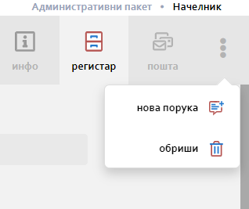

.. _registar:

**********
Регистар
**********

-УВОДНИ ТЕКСТ СА Сликама Листе и детаља  са објашњењем боотом менија

.. image:: ../_static/img/Evidencija/evidencija.png
   :width: 600
   :align: center

Мени са опцијама

.. image:: ../_static/img/Navigacija/MenuSaOpcijama/menuopcije1.png
   :width: 400 
   :height: 300
   :align: center

У горњем десном углу екрана, налази се икона са три тачкице које представљаја мени са опцијама. Опције менија зависе од позиције корисника у апликацији.

Уколико се налазите на ентитету Набавке или Захтеви за Набавку, мени са опцијама садржи: Нови Запис и Извоз Података.

Нови Запис 

Нови запис 

 Неки од могућих опција које ће касније бити објашњене су :

 *  Додавање новог записа
 *  Извоз података из грида
 *  Брисање записа
 *  Нова порука

Типови поља
------------

-УВОДНИ ТЕКСТ-

Стринг
=======

-Опис и слика-

Број
=====

-Опис и слика-

Износ
======

-Опис и слика-

Датум
======

-Опис и слика-

Логичка вредност
=================

-Опис и слика-

Корисник
=========

-Опис и слика-

Предефинисана вредност
=======================

-Опис и слика-

Статус
=======

-Опис и слика-

Листа
------

-Уводни текст објаснити за шта служи и примере у пракси-

-Слике листе са описима интеракција-

Филтер
=======

Детаљ
-------

-Уводни текст објаснити за шта служи и примере у пракси, још једном поменути breadcrumbs-

-Слике листе са описима интеракција-

Инфо панел
===========

-Уводни текст и слика-
