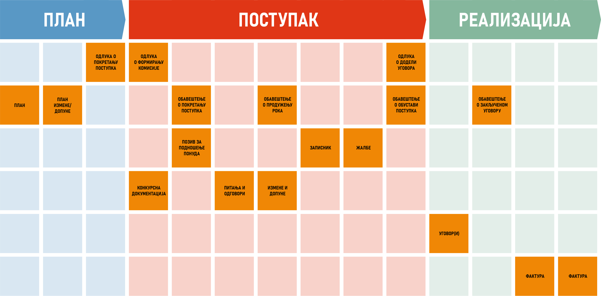
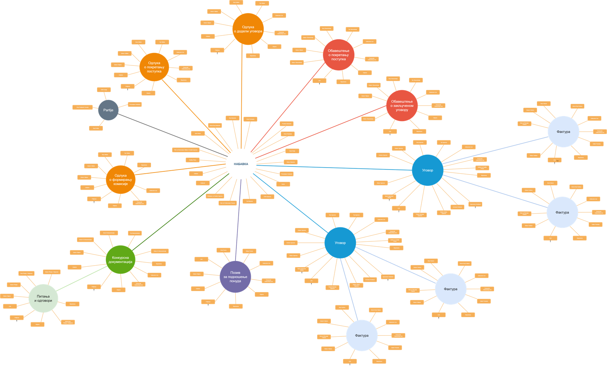

.. _koncept:

Концепт
=======

Ако бисмо у једној реченици морали да објаснимо шта је MeON, дефиниција би била следећа:

MeON
   софтверски систем намењен евиденцији, праћењу и контроли процеса у области набавки у државним предузећима

Да бисмо на прави начин разумели шта ова дефиниција заиста значи, шта MeON може пружити кориснику и на који начин, детаљније ћемо се позабавити набавкама као процесом.

Увод
----

Уколико покушамо да сагледамо набавку у државном предузећу у целини, схватићемо да је то процес који је захтеван на много начина. На првом месту то је чињеница да су државне набавке под будним оком закона више него остале и да се законске директиве/регулативе морају поштовати у потпуности у свим фазама процеса. Једна од ствари која чине процес захтевним је велики број субјеката у оквиру и ван организације који суделују у процесу. Комуникација се одвија на више нивоа и информације се размењују непрекидно. Комплексност расте са количином и величином набавки тако да су евиденција документације, могућност контроле и транспарентност процеса круцијални фактори у остварењу циља.

MeON апликација је створена како би елиминисала негативне утицаје комплексности и омогућила несметан процес. То чини на више страна:

Организациони део
   У потпуности се прилагођава интерној организацији у смислу да не захтева измену постојећих интерних процедура потребама апликације. Шта више, MeON омогућава праћење свих релевантних информација по потребама организације а које се не тичу закона.

Законски део
   Омогућава кориснику унос и праћење законских података уз поштовање законских процедура. Уз то пружа подршку у добијању информација из актуелних закона.

Информациони део
   Омогућава лаку евиденцију документације (и других релеватних података), квалитативну и квантитативну анализу процеса кроз извештаје. Такође, поштује начела приватности и доступности података.

Комуникациони део
   Омогућава интуитивну комуникацију на више нивоа унутар организације. Намењена је свим људима унутар организације који учествују у процесу набавке, од извршиоца до директора.

Да бисмо разумели начин на који MeON све ово постиже, морамо кренути од суштине: података.

Подаци
------

   Документи кроз фазе набавке

Мноштво је података који се евидентирају и прате у току процеса. У првом реду су то законска документа попут Плана, разних Одлука, Обавештења или Позива, Конкурсне Документације, Уговора или Фактура. Неки од њих су јединствени, неки се понављају, неки су измене основних докумената итд. Такође, могу се евидентирати подаци који служе искључиво интерним потребама организације попут задужених лица, статуса или рокова. Статус плаћања фактуре, задужено лице или рок за израду конкурсне документације су подаци који су саставни део процеса исто колико и законска документа. Када се број набавки у предузећу мултиплицира са количином података о једној набавци, добијамо велики број података који се прати и контролише. Све ове податке MeON омогућава да се евидентирају лако и благовремено, без обзира којег су типа и значаја. Уз то, омогућена је и колаборација корисника на тему конкретне набавке, уговора, фактуре или било ког другог ентитета.  

.. HINT::
   MeON апликација омогућава кориснику да евидентира како законске тако и податке које се тичу интерне организације

.. _entiteti:

Ентитети
--------

У данашње време, свака организација поседује софтверски информациони систем који евидентира, прати и контролише релевантне процесе. То може бити Excel или SAP, али сви они имају једну заједничку функционалност а то је свакако претрага података, тј. претрага регистра. Фактуре, Уговори, Набавке...све су то појмови над којима се врши нека врста претраге и евидентирање релевантних података. MeON ове појмове (као и неке друге) посматра као ентитете, да би унифицирао одређене радње попут претраге и евиденције. Дакле, сви ентитети у MeON апликацији имају сопствени регистар и све радње око претраге и евиденције су прилично исте за све њих. Нема много разлике у претрази или евиденцији фактура и уговора (сем самих података који се евидентирају). MeON иде корак даље и све релевантне ентитете поставља у хијерархијску структуру. Тако нпр. имамо ентитет Набавке који представља основни ентитет у хијерархији. Њему припада Конкурсна Документација, Решење о образовању комисије или Уговор. Уговору припада Фактура. Испод Конкурсне Документације је Питање. Ово је потребно да би се просто знало која фактура припада ком уговору или који уговор припада којој набавци. Примена и значај ове функционалности у пракси ће бити показана у даљем тексту.

   Набавка - ентитети и структура

Сваки од поменутих ентитета садржи одређени број података који се прате. Већ смо закључили да постоје како законски тако и атрибути намењени интерним потребама организације. Ентитете у MeON апликацији можемо евидентирати, претраживати кроз регистар или филтрирати по овим атрибутима.

.. _atributi:

Атрибути
---------

Атрибути су основне карактеристике ентитета који се евидентирају и прате. Најпростији пример за то је Процењена вредност Набавке. То може бити и Рок за предају понуда или Плаћена вредност Фактуре. Ово су обично прости типови података попут: 

* слова (назив Набаке, назив Понуђача, разни описи)
* бројева (број Понуђача, број Партија)
* износа (процењена вредност Набавке, плаћена вредност Фактуре, уговорена вредност)
* предефинисаних вредности (статус Набавке, тип Набавке, статус Фактуре итд).

Дакле, сви релевантни подаци који се евидентирају су у једном од горе поменутих типова. На основу њих се врши претрага, уносе подаци или анализирају извештаји.

.. _instance:

Инстанце
---------
Вероватно сте приметили да користимо велико прво слово код навођења ентитета. Ово чинимо да бисмо направили јасну диференцијацију између Ентитета и Инстанци. Поменули смо да ентитети представљају појмове који се користе у процесу набавке (Набавка, Конкурсна Документација, Уговор, Фактура) и имају свој регистар. Овде ћемо увести појам Инстанце која представља конкретно појављивање одређеног ентитета. То може бити набавка бр. 202-1404/19 или уговор бр.6841/20. Најпростије речено, Инстанца ентитета представља конкретан документ у коме се налазе одређене информације а које даље кориснику омогућавају рад, анализу и контролу процеса набавке. У наредном тексту ћемо користити појам инстанце када се будемо реферисали на неки конкретан документ:

* инстанца Набавке (набавка бр. 202-1404/19)
* инстанца Уговора (уговор бр. 4453/20)
* инстанца Фактуре (фактура бр. 345345/20)

Пакети
-------

Кад гледамо податке из угла корисника, јасно је да одређени корисник има право приступа одређеним ентитетима и атрибутима. Тако се нпр. финансијска служба  треба бавити Фактурама, и одређеним деловима Уговора. Такође, финансијска служба треба имати основне информације о Набавци попут типа и врсте, или релевантних особа. ИТ служба се треба бавити Конкурсном Документацијом. Начелници нпр једини могу знати процењене вредности Набавке, остали не.

MeON ову проблематику решава кроз пакете који одређују то шта све корисник може видети у оквиру целокупног регистра набавки (са свим пратећим документима/подентитетима). Дакле, основна улога пакета је да из мноштва података који се евидентирају кроз организацију, одређеном кориснику пружи само њему релевантне:

* Ентитете
* Атрибуте

Пакети пружају још додатних могућности али о томе такође касније.