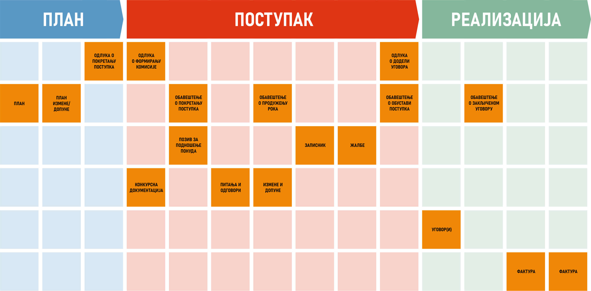

.. MeON documentation master file, created by
   sphinx-quickstart on Thu Apr 30 20:07:43 2020.
   You can adapt this file completely to your liking, but it should at least
   contain the root `toctree` directive.
.. _uvod:

Концепт
==========

Када погледамо набавку кроз фазе И призму докумената видимо скуп докумената који настају у сваким од фазама процеса. Неки су јединствени, неки се понављају, неки су измене основних докумената итд. Ова документа су законски неопходна, наравно у зависности од типа, врсте набавке и врсте поступка набавке. Поред ових докумената, потреба је корисника да евидентирају и неке друге документе или информације везане за интерну организацију.

.. image:: ../_static/img/nab_hijer.png
   :width: 600

Када се сви документи заједно са набавком групиши по хијерархији, добијамо скуп ентитета у одређеним релацијама (као на слици). Ово представља модел по коме МеОН апликација ради (објаснићу). Тако овде имамо набавку као главни ентитет, са одређеним атрибутима које евидентитамо и пратимо. Даље, испод имамо разне типове докумената (одлуке, обавештења, позиве, питања, конкурсну документацију, уговоре и фактуре). Сви ови ентитети имају сопствене атрибуте који се евидентирају и прате. Зашто је овај модел битан? Зато што се на основу ових веза и атрибута покрива целокупан процес процес у конкретном предузећу. Цела апликација је ограничена Моделом. Видећете да су сви менији дефинисани на основу дефиниције ентитета, гридови на основу поља итд... Ентитети, везе и атрибути су потпуно конфигурабилни. У преводу ово значи да можемо лако додавати нове атрибуте уколико се за то показе потреба, дефинисати нови статус итд...Типове података који се евидентирају ћу детаљно објаснити касније. 

Друга страна медаље је да модел као такав мора бити потврдјен да ради и покрива потребе корисника. Моја екипа и ја смо развили овај модел на основу закона и искуства које смо стицали паралелно са развојем апликације у сарадњи са некима од вас. Свака помоћ око оцене модела је добродошла поготово од стране људи који су у овом послу дуго времена.

Ентитети
--------

Пакети
------